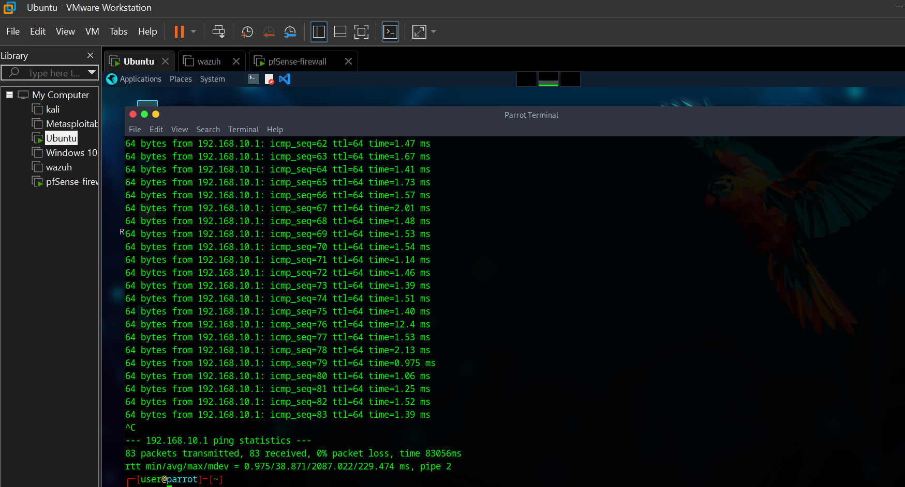
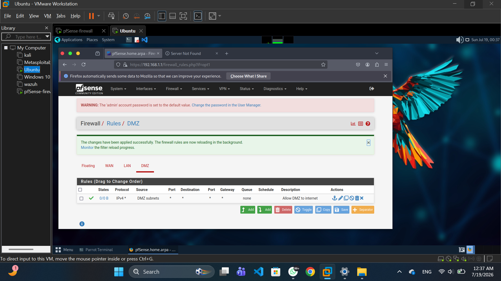

# Network Security Virtual Lab

## About the Project

This project was completed as part of a five-month cybersecurity training program. It involved designing and configuring a secure virtual network environment using VMware Workstation and pfSense Firewall. The project provided practical experience in network architecture, firewall configuration, network segmentation, and basic security testing, helping to develop hands-on skills in network security and firewall administration.

## Project Objective

* Design and configure a secure virtual network environment.
* Configure VMware Workstation virtual networks and virtual machines.
* Deploy and configure pfSense as a firewall and router.
* Configure WAN, LAN, and DMZ network interfaces.
* Implement network segmentation using a DMZ.
* Connect Kali Linux to the DMZ and verify network connectivity.
* Test communication, Internet access, and DNS resolution through the firewall.
* Develop practical skills in network security and firewall administration.

## Tools and Technologies

* VMware Workstation — Used to create and manage the virtual machines and virtual network environment.
* pfSense Community Edition — Used as the firewall, router, and network security gateway.
* Kali Linux — Used for security testing and network verification.
* Parrot OS — Used as an additional Linux security-testing environment in the virtual lab.
* Virtual Networking — Used to create and separate the WAN, LAN, and DMZ network segments.

## Network Architecture

The virtual lab was designed with separate WAN, LAN, and DMZ network segments. pfSense was configured as the central firewall and router, controlling traffic between the different network segments.

The DMZ used the 192.168.2.0/24 network and hosted Kali Linux for security testing and network verification.

## Practical Work Completed

* Created and configured virtual networks in VMware Workstation.
* Configured pfSense as the firewall.
* Configured WAN, LAN and DMZ interfaces.
* Configured the DMZ network using 192.168.2.0/24.
* Connected Kali Linux to the DMZ network.
* Configured DHCP for the DMZ network.
* Verified communication between Kali Linux and the pfSense firewall.
* Tested Internet connectivity through the firewall.
* Tested DNS resolution.
* Practiced network segmentation and firewall concepts.

## Security Configuration

The pfSense firewall was configured to manage and secure communication between the virtual network segments. The configuration included:

* WAN interface configuration for external connectivity.
* LAN interface configuration for the internal network.
* DMZ interface configuration using the 192.168.2.0/24 network.
* DHCP configuration for the DMZ network.
* Connection of Kali Linux to the DMZ.
* Verification of communication between Kali Linux and pfSense.
* Verification of Internet connectivity and DNS resolution through pfSense.

## Project Evidence

### Network Configuration

The virtual network environment and its interfaces were configured and tested during the practical training.

### Kali Linux Connectivity Testing

Kali Linux was connected to the network and connectivity was tested to verify communication and Internet access through the firewall.

## Chapter 3 – Practical Implementation

### Network Architecture

The network architecture was designed using VMware Workstation and pfSense Firewall. The virtual network consists of WAN, LAN, and DMZ segments, providing a structured and secure network environment.

### pfSense Firewall Configuration

pfSense was configured as the firewall and router for the virtual network. The configuration included WAN, LAN, and DMZ interfaces, with the DMZ network configured using the `192.168.2.0/24` network.

## Skills Demonstrated

* Network architecture and virtual network design
* VMware Workstation virtual lab configuration
* pfSense firewall administration
* WAN, LAN, and DMZ configuration
* Network segmentation
* DHCP configuration
* Basic network connectivity and troubleshooting
* Internet and DNS connectivity testing
* Network security testing
* Linux-based security lab experience

## Project Outcome

The project demonstrated the design and configuration of a secure virtual network environment using VMware Workstation and pfSense. The virtual lab implemented WAN, LAN, and DMZ network segmentation, with Kali Linux connected to the DMZ for security testing.

Network connectivity between Kali Linux and pfSense was verified, and Internet access and DNS resolution through the firewall were successfully tested. The project provided practical experience in firewall administration, network segmentation, virtual networking, and network security.

## Training

Completed as part of a five-month cybersecurity training program, with practical focus on network security, virtual networking, firewall administration, and security testing.
