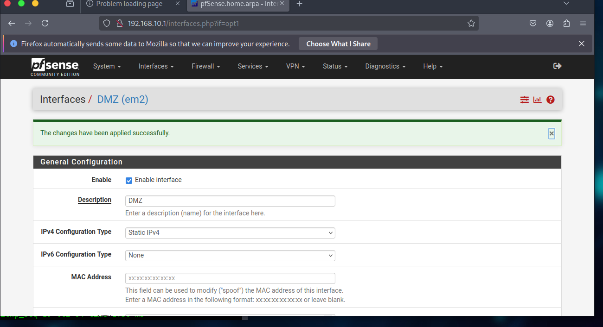
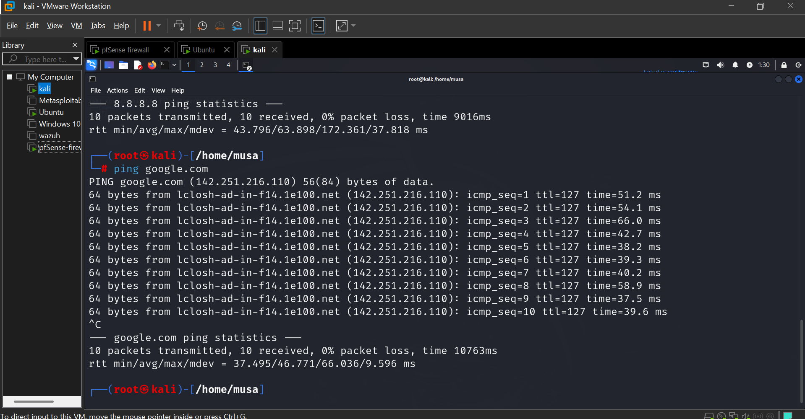

# Network Security Virtual Lab

## About the Project

This project was completed as part of my five-month cybersecurity training. It focused on designing and configuring a secure virtual network environment and developing practical skills in network security and firewall administration.

## Project Objective

The objective was to design and configure a segmented virtual network using VMware Workstation and pfSense Firewall, while testing secure communication between different network segments.

## Tools and Technologies

- VMware Workstation
- pfSense Community Edition
- Kali Linux
- Virtual Networking
- Firewall Configuration
- DHCP
- DNS
- WAN, LAN and DMZ
- Network Security

## Practical Work Completed

- Created and configured virtual networks in VMware Workstation.
- Configured pfSense as the firewall.
- Configured WAN, LAN and DMZ interfaces.
- Configured the DMZ network using 192.168.2.0/24.
- Connected Kali Linux to the DMZ network.
- Configured DHCP for the DMZ network.
- Verified communication between Kali Linux and the pfSense firewall.
- Tested Internet connectivity through the firewall.
- Tested DNS resolution.
- Practiced network segmentation and firewall concepts.

## Skills Demonstrated

- Network configuration
- Firewall administration
- Network segmentation
- Virtualization
- Basic network troubleshooting
- DHCP and DNS
- Network security
- Linux networking

## Project Outcome

The project provided hands-on experience in designing and configuring a secure virtual network environment and strengthened my understanding of firewall administration, network segmentation, connectivity testing, and network security.

## Training

Completed as part of a five-month cybersecurity training program.

## Project Evidence

### Network Architecture

The virtual network architecture was designed and configured as part of the cybersecurity training project.

### pfSense Firewall Configuration

pfSense was configured as the firewall to manage and secure communication between the network segments.

### Network Configuration

The virtual network environment and its interfaces were configured and tested during the practical training.

### Kali Linux Connectivity Testing

Kali Linux was connected to the network and connectivity was tested to verify communication and Internet access through the firewall.

